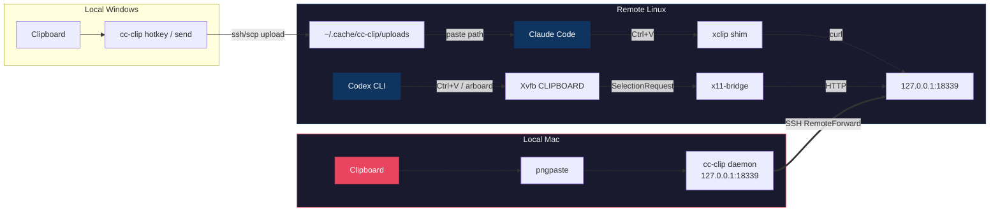

<p align="center">
  
</p>
<h1 align="center">cc-clip</h1>
<p align="center">
  <b>Paste images into remote Claude Code &amp; Codex CLI over SSH — as if it were local.</b>
</p>
<p align="center">
  <a href="https://github.com/ShunmeiCho/cc-clip/releases"></a>
  <a href="LICENSE"></a>
  <a href="https://go.dev"></a>
  <a href="https://github.com/ShunmeiCho/cc-clip/stargazers"></a>
</p>

<!-- TODO: Replace with actual GIF demo
<p align="center">
  
  <br>
  <em>Copy screenshot on Mac → SSH to remote → Ctrl+V in Claude Code → image appears</em>
</p>
-->

## The Problem

When running Claude Code or Codex CLI on a remote server via SSH, **image paste often doesn't work**. The remote clipboard is empty — no screenshots, no diagrams, no visual context. You're stuck with text-only.

## The Solution

```text
Claude Code (macOS):   Mac clipboard     → cc-clip daemon → SSH tunnel → xclip shim      → Claude Code
Claude Code (Windows): Windows clipboard → cc-clip hotkey → SSH/SCP       → remote file path → Claude Code
Codex CLI:             Mac clipboard     → cc-clip daemon → SSH tunnel → x11-bridge/Xvfb → Codex CLI
```

One tool. No changes to Claude Code or Codex. No terminal-specific hacks for the common path.

## Prerequisites

- **Local machine:** macOS 13+ or Windows 10/11
- **Remote server:** Linux (amd64 or arm64) accessible via SSH
- **SSH config:** You must have a Host entry in `~/.ssh/config` for your remote server

If you don't have an SSH config entry yet, add one:

```
# ~/.ssh/config
Host myserver
    HostName 10.0.0.1       # your server's IP or domain
    User your-username
    IdentityFile ~/.ssh/id_rsa  # optional, if using key auth
```

If you are on Windows and want the SSH/Claude Code workflow, use the dedicated guide:

- [Windows Quick Start](docs/windows-quickstart.md)

## Quick Start

### Step 1: Install cc-clip

macOS / Linux:

```bash
curl -fsSL https://raw.githubusercontent.com/ShunmeiCho/cc-clip/main/scripts/install.sh | sh
```

Windows:

Follow the dedicated guide:

- [Windows Quick Start](docs/windows-quickstart.md)

On macOS / Linux, add `~/.local/bin` to your PATH if prompted:

```bash
# Add to your shell profile (~/.zshrc or ~/.bashrc)
export PATH="$HOME/.local/bin:$PATH"

# Reload your shell
source ~/.zshrc  # or: source ~/.bashrc
```

Verify the installation:

```bash
cc-clip --version
```

> **macOS "killed" error?** If you see `zsh: killed cc-clip`, macOS Gatekeeper is blocking the binary. Fix: `xattr -d com.apple.quarantine ~/.local/bin/cc-clip`

### Step 2: Setup (one command)

macOS:

```bash
# For Claude Code only
cc-clip setup myserver

# For both Claude Code + Codex CLI
cc-clip setup myserver --codex
```

This single command:
1. Installs local dependencies (`pngpaste`)
2. Configures SSH (`RemoteForward`, `ControlMaster no`)
3. Starts the local daemon (via macOS launchd)
4. Deploys the binary and shim to the remote server

> **If setup reports an error**, read the error message carefully — it includes specific instructions for how to fix the issue. For example, if `Xvfb` is not found on the remote server and auto-install fails, you will see the exact command to run:
>
> ```bash
> # SSH into your server and install manually:
> ssh myserver
> sudo apt install xvfb          # Debian/Ubuntu
> sudo dnf install xorg-x11-server-Xvfb   # RHEL/Fedora
> ```
>
> After fixing, re-run `cc-clip setup myserver --codex`.

Windows:

Use the dedicated guide:

- [Windows Quick Start](docs/windows-quickstart.md)

### Step 3: Connect and use

macOS:

Open a **new** SSH session to your server (the tunnel activates on SSH connection):

```bash
ssh myserver
```

Then use Claude Code or Codex CLI as normal — `Ctrl+V` now pastes images from your Mac clipboard.

> **Important:** The image paste works through the SSH tunnel. You must connect via `ssh myserver` (the host you set up). The tunnel is established on each SSH connection.

Windows:

See:

- [Windows Quick Start](docs/windows-quickstart.md)

### Verify it works

```bash
# Copy an image to your Mac clipboard first (Cmd+Shift+Ctrl+4), then:
cc-clip doctor --host myserver
```

On Windows, the equivalent quick check is:

- [Windows Quick Start](docs/windows-quickstart.md)

## Why cc-clip?

| Approach | Works over SSH? | Any terminal? | Image support? | Setup complexity |
|----------|:-:|:-:|:-:|:--:|
| Native Ctrl+V | Local only | Some | Yes | None |
| X11 Forwarding | Yes (slow) | N/A | Yes | Complex |
| OSC 52 clipboard | Partial | Some | Text only | None |
| **cc-clip** | **Yes** | **Yes** | **Yes** | **One command** |

## How It Works



1. **macOS Claude path:** the local daemon reads your Mac clipboard via `pngpaste`, serves images over HTTP on loopback, and the remote `xclip` shim fetches images through the SSH tunnel
2. **Windows Claude path:** the local hotkey reads your Windows clipboard, uploads the image over SSH/SCP, and pastes the remote file path into the active terminal
3. **Codex CLI path:** x11-bridge claims CLIPBOARD ownership on a headless Xvfb, serves images on-demand when Codex reads the clipboard via X11

## Security

| Layer | Protection |
|-------|-----------|
| Network | Loopback only (`127.0.0.1`) — never exposed |
| Auth | Bearer token with 30-day sliding expiration (auto-renews on use) |
| Token delivery | Via stdin, never in command-line args |
| Transparency | Non-image calls pass through to real `xclip` unchanged |

## Daily Usage

After initial setup, your daily workflow is:

```bash
# 1. SSH to your server (tunnel activates automatically)
ssh myserver

# 2. Use Claude Code or Codex CLI normally
claude          # Claude Code
codex           # Codex CLI

# 3. Ctrl+V pastes images from your Mac clipboard
```

The local daemon runs as a macOS launchd service and starts automatically on login. No need to re-run setup.

### Windows workflow

On Windows, some `Windows Terminal -> SSH -> tmux -> Claude Code` combinations do not trigger the remote `xclip` path when you press `Alt+V` or `Ctrl+V`. `cc-clip` therefore provides a Windows-native workflow that does not depend on remote clipboard interception.

For first-time setup and day-to-day usage, use:

- [Windows Quick Start](docs/windows-quickstart.md)

The Windows workflow uses a dedicated remote-paste hotkey (default: `Alt+Shift+V`) so it does not collide with local Claude Code's native `Alt+V`.

## Commands

| Command | Description |
|---------|-------------|
| `cc-clip setup <host>` | **Full setup**: deps, SSH config, daemon, deploy |
| `cc-clip setup <host> --codex` | Full setup with Codex CLI support |
| `cc-clip connect <host>` | Deploy to remote (incremental) |
| `cc-clip connect <host> --token-only` | Sync token only (fast) |
| `cc-clip connect <host> --force` | Full redeploy ignoring cache |
| `cc-clip doctor --host <host>` | End-to-end health check |
| `cc-clip status` | Show local component status |
| `cc-clip service install` | Install macOS launchd service |
| `cc-clip service uninstall` | Remove launchd service |
| `cc-clip send [<host>] --paste` | Windows: upload clipboard image and paste remote path |
| `cc-clip hotkey [<host>]` | Windows: register the remote upload/paste hotkey |

<details>
<summary>All commands</summary>

| Command | Description |
|---------|-------------|
| `cc-clip setup <host>` | Full setup: deps, SSH config, daemon, deploy |
| `cc-clip setup <host> --codex` | Full setup including Codex CLI support |
| `cc-clip connect <host>` | Deploy to remote (incremental) |
| `cc-clip connect <host> --codex` | Deploy with Codex support (Xvfb + x11-bridge) |
| `cc-clip connect <host> --token-only` | Sync token only (fast) |
| `cc-clip connect <host> --force` | Full redeploy ignoring cache |
| `cc-clip serve` | Start daemon in foreground |
| `cc-clip serve --rotate-token` | Start daemon with forced new token |
| `cc-clip service install` | Install macOS launchd service |
| `cc-clip service uninstall` | Remove launchd service |
| `cc-clip service status` | Show service status |
| `cc-clip send [<host>]` | Upload clipboard image to a remote file |
| `cc-clip send [<host>] --paste` | Windows: paste the uploaded remote path into the active window |
| `cc-clip hotkey [<host>]` | Windows: run a background remote-paste hotkey listener |
| `cc-clip hotkey --enable-autostart` | Windows: start the hotkey listener automatically at login |
| `cc-clip hotkey --disable-autostart` | Windows: remove hotkey auto-start at login |
| `cc-clip hotkey --status` | Windows: show hotkey status |
| `cc-clip hotkey --stop` | Windows: stop the hotkey listener |
| `cc-clip doctor` | Local health check |
| `cc-clip doctor --host <host>` | End-to-end health check |
| `cc-clip status` | Show component status |
| `cc-clip uninstall` | Remove xclip shim from remote |
| `cc-clip uninstall --codex` | Remove Codex support (local) |
| `cc-clip uninstall --codex --host <host>` | Remove Codex support from remote |

</details>

## Configuration

All settings have sensible defaults. Override via environment variables:

| Setting | Default | Env Var |
|---------|---------|---------|
| Port | 18339 | `CC_CLIP_PORT` |
| Token TTL | 30d | `CC_CLIP_TOKEN_TTL` |
| Debug logs | off | `CC_CLIP_DEBUG=1` |

<details>
<summary>All settings</summary>

| Setting | Default | Env Var |
|---------|---------|---------|
| Port | 18339 | `CC_CLIP_PORT` |
| Token TTL | 30d | `CC_CLIP_TOKEN_TTL` |
| Output dir | `$XDG_RUNTIME_DIR/claude-images` | `CC_CLIP_OUT_DIR` |
| Probe timeout | 500ms | `CC_CLIP_PROBE_TIMEOUT_MS` |
| Fetch timeout | 5000ms | `CC_CLIP_FETCH_TIMEOUT_MS` |
| Debug logs | off | `CC_CLIP_DEBUG=1` |

</details>

## Platform Support

| Local | Remote | Status |
|-------|--------|--------|
| macOS (Apple Silicon) | Linux (amd64) | Stable |
| macOS (Intel) | Linux (arm64) | Stable |
| Windows 10/11 | Linux (amd64/arm64) | Experimental (`send` / `hotkey`) |

## Requirements

**Local (macOS):** macOS 13+ (`pngpaste`, auto-installed by `cc-clip setup`)

**Local (Windows):** Windows 10/11 with PowerShell, `ssh`, and `scp` available in `PATH`

**Remote:** Linux with `xclip`, `curl`, `bash`, and SSH access. The macOS tunnel/shim path is auto-configured by `cc-clip connect`; the Windows upload/hotkey path uses SSH/SCP directly.

**Remote (Codex `--codex`):** Additionally requires `Xvfb`. Auto-installed if passwordless sudo is available, otherwise: `sudo apt install xvfb` (Debian/Ubuntu) or `sudo dnf install xorg-x11-server-Xvfb` (RHEL/Fedora).

## Troubleshooting

```bash
# One command to check everything
cc-clip doctor --host myserver
```

<details>
<summary><b>"zsh: killed" after installation</b></summary>

**Symptom:** Running any `cc-clip` command immediately shows `zsh: killed cc-clip ...`

**Cause:** macOS Gatekeeper blocks unsigned binaries downloaded from the internet.

**Fix:**

```bash
xattr -d com.apple.quarantine ~/.local/bin/cc-clip
```

Or reinstall (the latest install script handles this automatically):

```bash
curl -fsSL https://raw.githubusercontent.com/ShunmeiCho/cc-clip/main/scripts/install.sh | sh
```

</details>

<details>
<summary><b>"cc-clip: command not found"</b></summary>

**Cause:** `~/.local/bin` is not in your PATH.

**Fix:**

```bash
# Add to your shell profile
echo 'export PATH="$HOME/.local/bin:$PATH"' >> ~/.zshrc
source ~/.zshrc
```

Replace `~/.zshrc` with `~/.bashrc` if you use bash.

</details>

<details>
<summary><b>Ctrl+V doesn't paste images (Claude Code)</b></summary>

**Step-by-step verification:**

```bash
# 1. Local: Is the daemon running?
curl -s http://127.0.0.1:18339/health
# Expected: {"status":"ok"}

# 2. Remote: Is the tunnel forwarding?
ssh myserver "curl -s http://127.0.0.1:18339/health"
# Expected: {"status":"ok"}

# 3. Remote: Is the shim taking priority?
ssh myserver "which xclip"
# Expected: ~/.local/bin/xclip  (NOT /usr/bin/xclip)

# 4. Remote: Does the shim intercept correctly?
# (copy an image to Mac clipboard first)
ssh myserver 'CC_CLIP_DEBUG=1 xclip -selection clipboard -t TARGETS -o'
# Expected: image/png
```

If step 2 fails, you need to open a **new** SSH connection (the tunnel is established on connect).

If step 3 fails, the PATH fix didn't take effect. Log out and back in, or run: `source ~/.bashrc`

</details>

<details>
<summary><b>New SSH tab says "remote port forwarding failed for listen port 18339"</b></summary>

**Symptom:** A newly opened SSH tab warns `remote port forwarding failed for listen port 18339`, and image paste in that tab does nothing.

**Cause:** `cc-clip` uses a fixed remote port (`18339`) for the reverse tunnel. If another SSH session to the same host already owns that port, or a stale `sshd` child is still holding it, the new tab cannot establish its own tunnel.

**Fix:**

```bash
# Inspect the remote port without opening another forward:
ssh -o ClearAllForwardings=yes myserver "ss -tln | grep 18339 || true"
```

- If another live SSH tab already owns the tunnel, use that tab/session, or close it before opening a new one.
- If the port is stuck after a disconnect, follow the stale `sshd` cleanup steps below.
- If you truly need multiple concurrent SSH sessions with image paste, give each host alias a different `cc-clip` port instead of sharing `18339`.

</details>

<details>
<summary><b>Ctrl+V doesn't paste images (Codex CLI)</b></summary>

> **Most common cause:** DISPLAY environment variable is empty. You must open a **new** SSH session after setup — existing sessions don't pick up the updated shell rc file.

**Step-by-step verification (run these on the remote server):**

```bash
# 1. Is DISPLAY set?
echo $DISPLAY
# Expected: 127.0.0.1:0 (or 127.0.0.1:1, etc.)
# If empty → open a NEW SSH session, or run: source ~/.bashrc

# 2. Is the SSH tunnel working?
curl -s http://127.0.0.1:18339/health
# Expected: {"status":"ok"}
# If fails → open a NEW SSH connection (tunnel activates on connect)

# 3. Is Xvfb running?
ps aux | grep Xvfb | grep -v grep
# Expected: a Xvfb process
# If missing → re-run: cc-clip connect myserver --codex --force

# 4. Is x11-bridge running?
ps aux | grep 'cc-clip x11-bridge' | grep -v grep
# Expected: a cc-clip x11-bridge process
# If missing → re-run: cc-clip connect myserver --codex --force

# 5. Does the X11 socket exist?
ls -la /tmp/.X11-unix/
# Expected: X0 file (matching your display number)

# 6. Can xclip read clipboard via X11? (copy an image on Mac first)
xclip -selection clipboard -t TARGETS -o
# Expected: image/png
```

**Common fixes:**

| Step fails | Fix |
|-----------|-----|
| Step 1 (DISPLAY empty) | Open a **new** SSH session. If still empty: `source ~/.bashrc` |
| Step 2 (tunnel down) | Open a **new** SSH connection — tunnel is per-connection |
| Steps 3-4 (processes missing) | `cc-clip connect myserver --codex --force` from local |
| Step 6 (no image/png) | Copy an image on Mac first: `Cmd+Shift+Ctrl+4` |

> **Note:** DISPLAY uses TCP loopback format (`127.0.0.1:N`) instead of Unix socket format (`:N`) because Codex CLI's sandbox blocks access to `/tmp/.X11-unix/`. If you previously set up cc-clip with an older version, re-run `cc-clip connect myserver --codex --force` to update.

</details>

<details>
<summary><b>SSH ControlMaster breaks RemoteForward</b></summary>

**Symptom:** Tunnel works during `connect`, but `curl http://127.0.0.1:18339/health` hangs in your SSH session.

**Cause:** An existing SSH ControlMaster connection was reused without `RemoteForward`.

**Fix:** `cc-clip setup` auto-configures this. If you set up SSH manually, add to `~/.ssh/config`:

```
Host myserver
    ControlMaster no
    ControlPath none
```

</details>

<details>
<summary><b>Stale sshd process blocks port 18339</b></summary>

**Symptom:** `Warning: remote port forwarding failed for listen port 18339`

**Fix:** Kill the stale process on remote:

```bash
sudo ss -tlnp | grep 18339     # find the PID
sudo kill <PID>                  # kill it
```

Then reconnect: `ssh myserver`

</details>

<details>
<summary><b>Token expired after 30+ days of inactivity</b></summary>

**Fix:** `cc-clip connect myserver --token-only`

Token uses sliding expiration — auto-renews on every use. Only expires after 30 days of zero activity.

</details>

<details>
<summary><b>Launchd daemon can't find pngpaste</b></summary>

**Fix:** `cc-clip service uninstall && cc-clip service install` (regenerates plist with correct PATH).

</details>

<details>
<summary><b>Setup fails: "killed" during re-deployment</b></summary>

**Symptom:** `cc-clip setup` was working before, but now shows `zsh: killed` when re-running.

**Cause:** The launchd service is running the old binary. Replacing the binary while the daemon holds it open can cause conflicts.

**Fix:**

```bash
cc-clip service uninstall
curl -fsSL https://raw.githubusercontent.com/ShunmeiCho/cc-clip/main/scripts/install.sh | sh
cc-clip setup myserver
```

</details>

<details>
<summary><b>More issues</b></summary>

See [Troubleshooting Guide](docs/troubleshooting.md) for detailed diagnostics, or run `cc-clip doctor --host myserver`.

</details>

## Contributing

Contributions and bug reports welcome. Please [open an issue](https://github.com/ShunmeiCho/cc-clip/issues) first for major changes.

```bash
git clone https://github.com/ShunmeiCho/cc-clip.git
cd cc-clip
make build && make test
```

## Related

**Claude Code:**
- [anthropics/claude-code#5277](https://github.com/anthropics/claude-code/issues/5277) — Image paste in SSH sessions
- [anthropics/claude-code#29204](https://github.com/anthropics/claude-code/issues/29204) — xclip/wl-paste dependency

**Codex CLI:**
- [openai/codex#6974](https://github.com/openai/codex/issues/6974) — Linux: cannot paste image
- [openai/codex#6080](https://github.com/openai/codex/issues/6080) — Image pasting issue
- [openai/codex#13716](https://github.com/openai/codex/issues/13716) — Clipboard image paste failure on Linux
- [openai/codex#7599](https://github.com/openai/codex/issues/7599) — Image clipboard does not work in WSL

**Other:**
- [ghostty-org/ghostty#10517](https://github.com/ghostty-org/ghostty/discussions/10517) — SSH image paste discussion

## License

[MIT](LICENSE)
